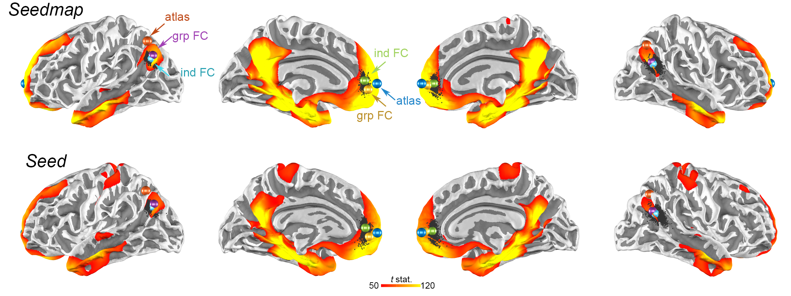
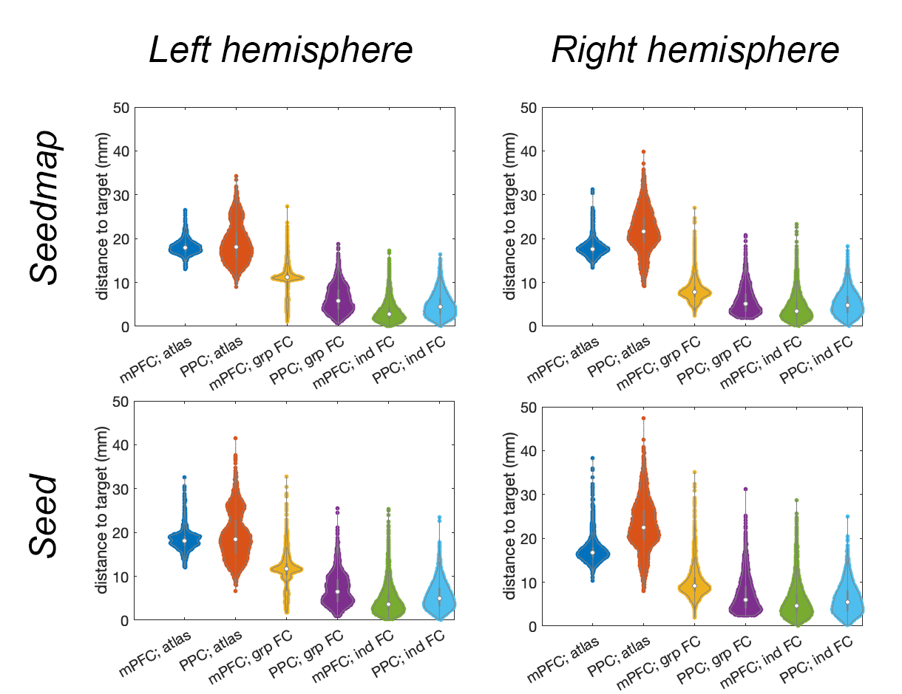
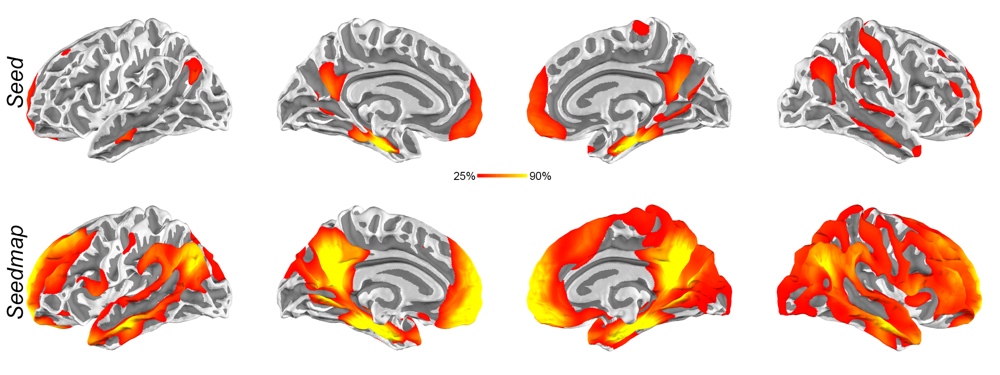

# The Hippocampal network for TMS from Human Connectome Project

Identifying the TMS cortical targets within the hippocampal network
Individualized transcranial magnetic stimulation (TMS) targeting using functional connectivity analysis of functional magnetic resonance imaging (fMRI) has been demonstrated to be advantageous in inducing neuroplasticity. However, how this approach can benefit modulating the episodic memory function supported by the hippocampal network remains elusive. 

Here, we use the resting-state fMRI data from a large cohort (Human Connectome Project) to reveal tentative TMS targets at cortical regions within the hippocampal network. We identified the average centroids of individualized targets at the medial prefrontal cortex (mPFC) and posterior parietal cortices (PPC) at [-10 50 10] and [-40 -70 31] in the left hemisphere, respectively.  The mPFC and PPC coordinate at the right hemispheres are [11 52 8] and [48 -60 24] in the right hemisphere, respectively. These coordinates can be reliably identified (>90% of individuals) when the seed time series in the functional connectivity analysis was derived from a weighted sum of time series at the cortex. Our results suggested candidate TMS target coordinates to improve the episodic memory function using TMS.

Reference:  Lee, H.-J. et al. _Hum. Brain Mapp._ (2025)

##

**Maps of functional connectivity to the hippocampus using Seedmap (top) or Seed (bottom) to extract the hippocampal time series from a large cohort (n = 1,133). ** Color represents t statistics. Black dots are the centroids of the functional connectivity at the medial prefrontal cortex (mPFC) and posterior parietal cortex (PPC) in each individual. Centroids of the group-level functional connectivity (grp FC) at mPFC and PPC are represented by brown and purple spheres, respectively. Average of centroids of individual functional connectivity (ind FC) at mPFC and PPC are represented by green and cyan spheres, respectively. Atlas coordinates at mPFC and PPC are represented by blue and orange spheres, respectively.

##

**TMS target coordinates and measures** (mean, median, standard deviation (Std), and interquartile range (IQR)) of the distance to TMS targets defined by atlas, group-level functional connectivity (grp FC), and individual functional connectivity (ind FC) at medial prefrontal cortex (mPFC) and posterior parietal cortex (PPC) using hippocampal time series defined by Seed and Seedmap approaches.

Left hemisphere

| Condition | mPFC_X | mPFC_Y | mPFC_Z | mPFC_mean | mPFC_std | mPFC_median | mPFC_IQR | PPC_X | PPC_Y | PPC_Z | PPC_mean | PPC_std | PPC_median | PPC_IQR |
|-----------|--------|--------|--------|-----------|----------|-------------|----------|-------|-------|-------|----------|---------|------------|---------|
| atlas     | 0      | 62     | 4      | 18.1      | 1.5      | 17.9        | 1.8      | -42   | -64   | 48    | 18.9     | 4.2     | 18.2       | 5.8     |
| grp FC    | -9     | 53     | -2     | 11.1      | 3.1      | 11.2        | 1.5      | -41   | -69   | 33    | 6.2      | 2.9     | 5.7        | 4.4     |
| ind FC    | -10    | 49     | 7      | 3.4       | 2.3      | 2.8         | 2.6      | -40   | -67   | 30    | 4.8      | 2.6     | 4.4        | 3.6     |

Right hemisphere

| Condition | mPFC_X | mPFC_Y | mPFC_Z | mPFC_mean | mPFC_std | mPFC_median | mPFC_IQR | PPC_X | PPC_Y | PPC_Z | PPC_mean | PPC_std | PPC_median | PPC_IQR |
|-----------|--------|--------|--------|-----------|----------|-------------|----------|-------|-------|-------|----------|---------|------------|---------|
| atlas     | 0      | 62     | 4      | 17.8      | 1.7      | 17.7        | 1.7      | 40    | -66   | 44    | 21.8     | 4.6     | 21.6       | 5.7     |
| grp FC    | 10     | 56     | 2      | 8.2       | 2.4      | 7.9         | 2.3      | 45    | -60   | 27    | 5.8      | 2.9     | 5.1        | 4.0     |
| ind FC    | 12     | 50     | 4      | 4.2       | 2.9      | 3.5         | 3.3      | 46    | -59   | 25    | 5.2      | 2.7     | 4.8        | 3.7     |

##

**Violin plots of the distance** between an individual’s functional connectivity centroid to TMS targets defined by group-level functional connectivity (grp FC), average of individual’s functional connectivity (ind FC), and atlas coordinates (atlas) at mPFC and PPC using Seedmap (top) and Seed (bottom) approaches to describe the hippocampal time series. 

##

**Penetration maps of functional connectivity ** using Seed (top) and Seedmap (bottom) approaches across 1,133 individuals. The color of each brain area represents the percentage of the population showing significant functional connectivity to the hippocampus.

